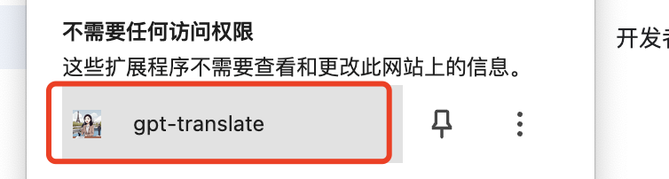
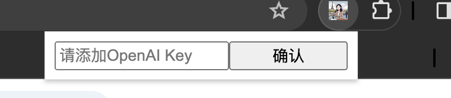
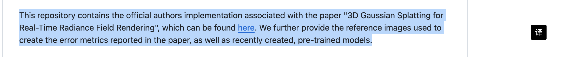

# gpt-translate


## 简介
基于 OpenAI 定义 Chrome 划词翻译的插件，主要方便自己使用。

## 使用
1. 加载插件后启用插件


2. 输入 GPT KEY，我很穷，没办法提供免费的服务，使用者自己买吧


3. 划词点击翻译即可



## 开发

执行后，Chrome 加载打开 chrome://extensions/ 点击加载 **已解压的扩展程序**，加载工程dist目录即可。(PS: 由于自用，未上传到Chrome应用商店)

``` 
npm run dev
``` 

## 打包

```
npm run build
```


